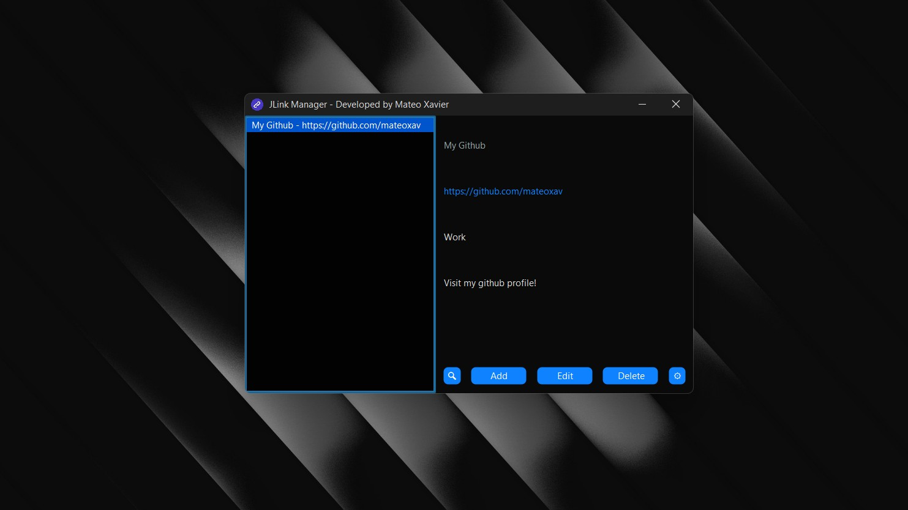

# 🚀 JLink Manager - Favorites Link Manager 🔗


### ✨ Description.

JLink Manager is a desktop application developed in **Java Swing** that allows you to manage favorite links in a simple and organized way. The links are stored in a JSON file, which facilitates their persistence without the need for a database.

### 🛠️ Functionalities.

- ✅ **Add Links**: Enter a title, URL, category and additional notes.
- 🔄 **Edit Links**: Modify the information of an existing link.
- 🗑️ **Remove Links**: Deletes links from the list.
- 🔍 **Search Links**: Finds matches in all fields of the saved links.
- 👀 **Preview**: Displays the details of the selected link.
- 🌐 **Open Links**: Allows you to access URLs directly from the application.
- 📋 **Copy Link to Clipboard**: By clicking on the URL title, it is automatically copied to the clipboard.
- 🎨 **Custom Interface**: `FlatMacDarkLaf` theme has been applied with custom colors to improve the aesthetics of the application.

### 🔧 Technologies Used.

- 🖥️ **Language**: Java
- 🏗️ **Graphical Interface**: Java Swing
- 📂 **Data Persistence**: JSON with the Jackson Library
- 📦 **Dependency Management**: Maven
- 🎭 **Interface Style**: FlatLaf (`FlatMacDarkLaf`)

### 📌 Installation and Usage.
### Option 1) Download from github
1. **Go to [Releases](https://github.com/mateoxav/j-link-manager/releases/tag/0.1.0)**.

   If you are using **Windows** download **JLinkManager.exe** and run it.
   
   Download **j-link-manager-0.1.0-RELEASE.jar** if you are using **Mac/Linux**, and follow the step below. 

3. **Run the Application**(Make sure Java is installed): 
   ```sh
   java -jar j-link-manager-0.1.0-RELEASE.jar
   ```
### Option 2) Compile source code
1. **Clone Repository**:
   ```sh
   git clone https://github.com/mateoxav/j-link-manager.git
   cd j-link-manager
   ```
2. **Compile with Maven** (Make sure Maven is installed):
   ```sh
   mvn clean package
   ```
3. **Run the Application**:
   ```sh
   java -jar target/j-link-manager-0.1.0-RELEASE.jar
   ```
